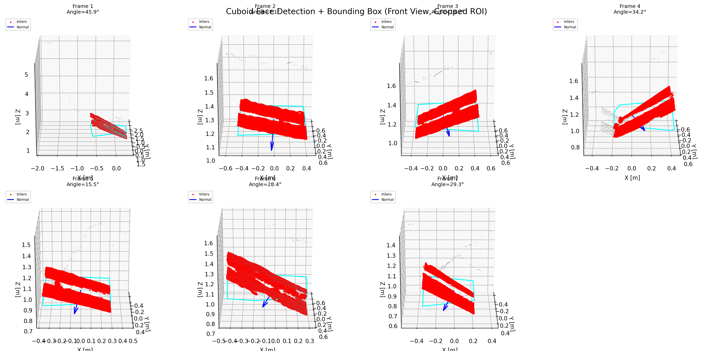
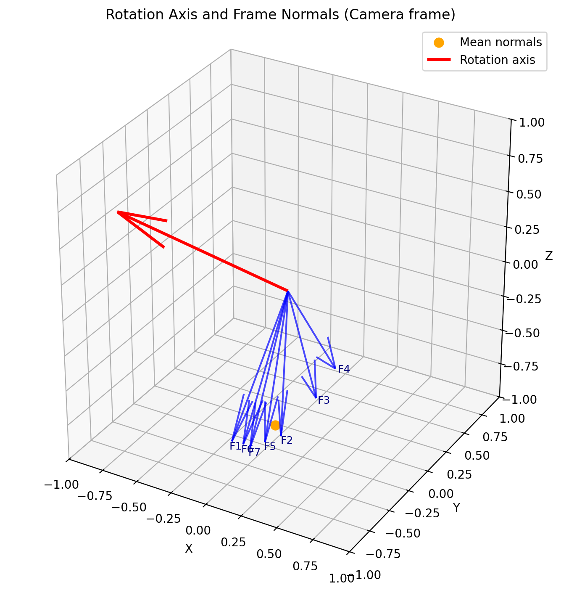
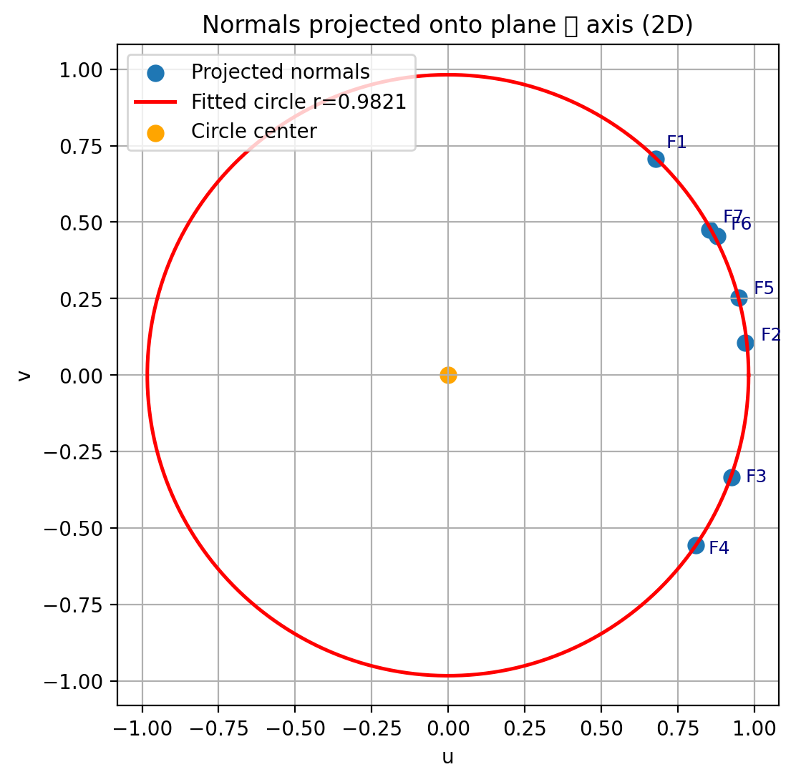

# Full Pipeline: Depth-to-Plane Detection and Rotation Axis Estimation

This project provides a **complete pipeline** for processing depth frames recorded in a ROS2 bag (`.db3`) file to:

1. Convert depth maps into 3D point clouds  
2. Detect visible cuboid faces using **RANSAC plane fitting**  
3. Compute each plane’s **normal vector**, **angle**, and **visible area**  
4. Identify the **largest visible face**  
5. Estimate the **rotation axis** of the cuboid using **SVD/PCA on normals**  
6. Visualize results in both **3D** and **2D projected space**  
7. Save all output plots and data into a single `Results/` folder  

---

## Project Structure

```
project_root/
│
├── depth_data/                      # Folder containing ROS2 bag files (.db3 + metadata.yaml)
│   ├── data.db3
│   └── metadata.yaml
│
├── Results/                         # Auto-created output directory
│   ├── ransac_results.csv
│   ├── ransac_results_with_axis.csv
│   ├── largest_visible_face.txt
│   ├── rotation_axis.txt
│   ├── rotation_axis_3d.png
│   ├── normals_projected_circle.png
│   └── ransac_frames_overview.png
│
├── full_pipeline.py        # Main pipeline script
├── requirements.txt                 # Dependencies
└── README.md                        # This file
```

---

## How It Works

### Step 1 — Depth Data Input
The script reads depth frames from a **ROS2 bag** using the [`rosbags`](https://pypi.org/project/rosbags/) library.  
By default, it looks for a folder called `depth_data` in the same directory as the script.

### Step 2 — RANSAC Plane Fitting
For each frame:
- The image is **cropped to a central ROI**.
- Depth pixels are converted to a **3D point cloud**.
- **RANSAC** fits the dominant plane (the visible cuboid face).
- The normal vector and visible surface area are computed.

A combined figure shows all frames, fitted planes, and normals, saved as:
```
Results/ransac_frames_overview.png
```

### Step 3 — Largest Visible Face
The frame with the **largest visible area** is automatically identified and logged to:
```
Results/largest_visible_face.txt
```

### Step 4 — Rotation Axis Estimation
Using all plane normals across frames, **SVD (Singular Value Decomposition)** estimates the cuboid’s **rotation axis**.

Visualizations:
- **3D plot** of normals + rotation axis → `rotation_axis_3d.png`
- **2D projection** of normals on the plane ⟂ axis → `normals_projected_circle.png`

Numerical results are saved to:
```
Results/rotation_axis.txt
Results/circle_fit_results.txt
```

---

## Outputs

| File | Description |
|------|--------------|
| `ransac_results.csv` | Per-frame plane metrics (normals, angle, visible area) |
| `ransac_results_with_axis.csv` | Extended CSV including estimated rotation axis |
| `largest_visible_face.txt` | Summary of the largest visible face |
| `rotation_axis.txt` | Estimated rotation axis (unit vector, SVD diagnostics) |
| `rotation_axis_3d.png` | 3D visualization of normals and rotation axis |
| `normals_projected_circle.png` | 2D projection of normals and fitted rotation circle |
| `ransac_frames_overview.png` | Combined 3D plots for first few frames |

---

## Installation

### Requirements
All dependencies are listed in `requirements.txt`.  
You can install them with:

```bash
pip install -r requirements.txt
```

### Python version
Python **3.8+** is recommended.

### Dependencies
- `numpy`
- `pandas`
- `matplotlib`
- `opencv-python`
- `scipy`
- `scikit-learn`
- `rosbags`

---

## Usage

### Default mode
Simply place your ROS2 bag folder (`depth_data/`) next to the script, and run:

```bash
python full_pipeline.py
```

The script will:
- Read the bag file
- Fit planes and compute normals
- Estimate the rotation axis
- Display plots and save all results in `Results/`

### Headless / Save-only mode
To run without showing any plots (useful for remote or batch runs):

```bash
python full_pipeline.py --no-plots
```

### Custom bag or topic
You can also specify custom paths:

```bash
python full_pipeline.py --bag "/path/to/your/bag_folder" --topic "/depth"
```

---

## Example Outputs

**1. Plane detection overview**



**2. Rotation axis visualization**



**3. Projected normals and fitted circle**



---

## Math Overview

- **Plane equation:**  
  \( z = a x + b y + c \)

- **Normal vector:**  
  \( \mathbf{n} = [a, b, -1] / ||[a, b, -1]|| \)

- **Rotation axis (SVD):**  
  The smallest singular vector of the centered normal matrix represents the **axis of rotation**.

---

## Author
**Anurakt Raj Mathur**  
Focus: ROS2, Autoware, Sensor Fusion, EKF, 3D Perception, Vehicle Dynamics  

---

## License
MIT License — feel free to use, modify, and distribute with attribution.

---
